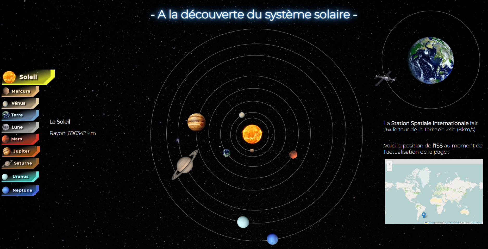

# Projet Data Viz et API - juin-2023   
  
## Présentation    
  
Nous sommes Marie, Alexis, Alexandre et Paula, développeurs et développeuses web en formation chez Ada Tech School    
 
## Projet : A la découverte du système Solaire     
Dans le cadre d'un projet d'étude, nous avons créé une visualisation de données via trois API.   
Nous présentons le système Solaire ainsi qu'une carte représentant la position en direct (au moment de l'actualisation de la page) de la Station Spatiale Internationale.     
 
## Pré-requis     
* Avoir un navigateur basé sur Chromium (Brave, Google Chrome, Opera...).
 
## Exigences nécessaires    
* JS    
* HTML    
* CSS    

## Ressources utilisées    
les API suivantes :     
* https://api.le-systeme-solaire.net    
* https://fabdev.fr/articles/iss-python/    
* https://www.openstreetmap.fr     
        
Une librairie :  
* https://leafletjs.com/       

                

